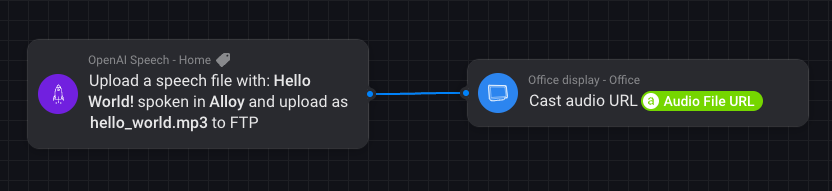

# OpenAI Speech

Allows you to use the OpenAI API to generate speech from text. The resulting file will be uploaded to your Homey's FTP.
Which then can be used in flows to play the audio file. For example to cast it to a Google Home device.

## App Configuration
- Install the HTTPFTP-Server app by Emile https://homey.app/nl-nl/app/net.weejewel.ftpserver/HTTPFTP-Server/
- Create a new FTP account in the FTP server app
- Get an OpenAI API key from https://platform.openai.com/api-keys 

## Device configuration
- Add a new device in the Homey app
- Select OpenAI Speech
- FIll in the settings
  - OpenAI API key; the API key you got from the OpenAI platform
  - Host; the IP address of your Homey
  - FTP Port; the port of the FTP server (default is 2100)
  - FTP Username; the username of the FTP account you created
  - FTP Password; the password of the FTP account you created
  - HTTP Port; the port of the HTTP server (default is 8000)

## Use in flows

